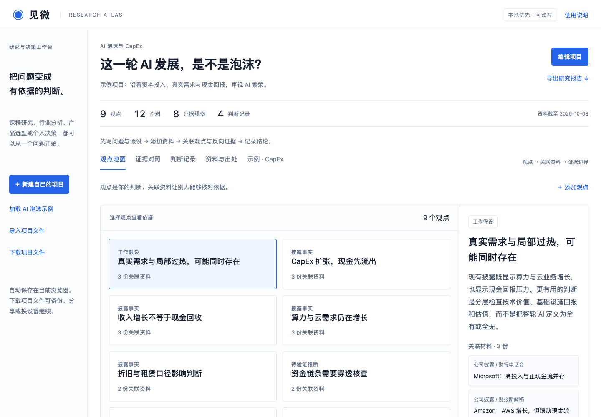
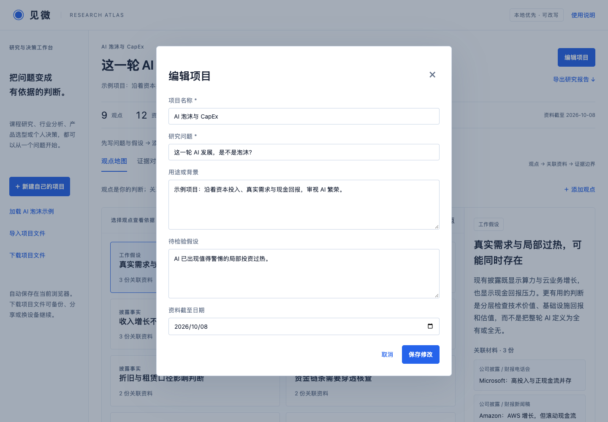

# 见微 · 可改写的研究与决策工作台

**把一个问题、你的判断和参考材料放在一起，形成能核对、能修订、能分享的研究记录。** 不需要改代码：打开页面，新建项目，填写自己的主题即可。AI 泡沫与 CapEx 是内置案例，不是工具的唯一用途。

[打开在线工作台](https://cl4793-del.github.io/jianwei-ai-capex/) · [五分钟使用指南](docs/user-guide.md) · [项目文件格式](docs/project-format.md)

## 它有什么用？

阅读资料时，我们容易只记下结论，忘记依据；比较方案时，也容易只收集支持自己的材料。见微让观点关联到具体资料，把反向证据放在同一页，并记录判断为什么变化。最终可以下载一份带出处的 Markdown 报告，或把整个项目交给别人继续改写。

| 使用场景 | 你可以整理什么 | 最终得到什么 |
| --- | --- | --- |
| 课程论文或文献阅读 | 研究问题、文章摘要、观点、反证 | 有出处的论证提纲 |
| 行业研究 | 财报、新闻、分析假设与证据边界 | 可更新的研究记录 |
| 产品选型或团队决策 | 候选方案资料、支持与反对理由 | 决策依据与修订记录 |
| 个人学习与判断 | 阅读笔记、待解问题、当前结论 | 可复用、可分享的主题项目 |

## 五分钟使用

1. 打开网站，点击 **新建自己的项目**，填写名称、问题和待检验假设。第一次打开会显示 AI 案例，帮助理解完整项目是什么样的。
2. 在 **资料与出处** 添加文章、访谈或个人笔记，保存摘要、原文链接和证据边界。链接可留空；页面不会自动读取文章。
3. 在 **观点地图** 添加你的判断，勾选关联资料。点击观点卡片即可查看依据；不需要把所有资料堆在一段结论里。
4. 在 **证据对照** 添加支持和挑战同一个假设的线索。不要把不同问题的赞成与反对混在一起。
5. 在 **判断记录** 写下日期、当时的判断和修订原因；在页面底部维护当前结论与下一步。
6. 点击 **导出研究报告** 下载 Markdown；点击 **下载项目文件** 下载 JSON，用于备份、分享或换设备继续编辑。

例如，题目可以改成「我们的团队是否应采用远程办公？」：添加团队反馈与已有政策资料，关联效率、协作与成本观点，再记录支持和挑战该假设的证据。你的主题、材料和结论都由你维护。

## 已经能做的功能

| 功能 | 实际行为 |
| --- | --- |
| 项目编辑 | 改写名称、研究问题、背景、假设和资料日期 |
| 资料管理 | 新增、编辑、删除资料，保留摘要、链接和证据边界 |
| 观点关联 | 将一个观点关联多份材料，点击查看依据 |
| 证据对照 | 手动添加支持 / 挑战当前假设的证据 |
| 判断记录 | 按添加顺序记录判断与变化原因，可填写日期 |
| 本地保存 | 表单保存及结论编辑自动写入当前浏览器 |
| 文件迁移 | 导出 / 导入完整 JSON 项目，别人导入后可以继续编辑 |
| 报告导出 | 导出包含观点、证据、资料与判断记录的 Markdown |
| 内置案例 | 加载 AI 泡沫案例；CapEx 表仅是该案例的固定补充 |

共享项目文件是**复制后各自编辑**，不是多人实时协作。接收者打开同一网站，点击「导入项目文件」即可继续改写；双方修改不会自动合并。

## 项目预览



<details><summary>查看项目编辑表单</summary>



</details>

## 保存、分享与限制

无需账号。研究内容只保存在当前浏览器的 localStorage，不上传到 GitHub 或服务器。**清除浏览器网站数据会删除本地记录，请下载项目文件备份。** 新建、加载案例或导入文件会替换当前工作区，并提示确认；当前只维护一个工作区，多项目请分别下载 JSON。

导出的文件包含你填写的全部研究内容，分享前请自行检查。项目不调用运行时 AI、不自动抓取网页、不验证资料真实性、不自动生成判断；AI 辅助了产品设计、开发和案例整理。它的实用性来自组织、追溯、修订与导出研究，而不是替用户作出答案。

当前不支持附件上传、账户同步、团队实时协作、任意财务表格编辑或自动数据更新。观点地图使用卡片展示「观点 → 材料」关系，不生成因果图。导入会检查格式、关联编号和链接协议；文本按纯文字显示。

## 可直接导入的项目文件

- [AI 泡沫与 CapEx 完整案例](examples/ai-capex.json)：包含公开来源、编辑分析及示例判断记录。案例资料截至 2026-10-08；固定 CapEx 表不会随着你改写资料自动更新。
- [空白项目模板](examples/blank-project.json)：从自己的问题开始，导入后在页面编辑。

AI 案例的财务口径、来源与比较限制见 [案例数据说明](docs/data-notes.md)。这些是示例内容，不是通用功能的必要输入。

## 本地运行与部署

原生 HTML、CSS、JavaScript，无依赖、无构建步骤。在仓库目录运行：

```bash
python3 -m http.server 8765 --directory dist
```

打开 `http://localhost:8765/`。复制或 Fork 项目后，在 GitHub **Settings → Pages** 选择 **GitHub Actions**，仓库内的发布流程会上传 `dist/`。部署自己的副本后，浏览器保存与原站相互独立；通过项目 JSON 文件迁移即可。

开发者可以修改 `dist/research-data.js` 来更换首次打开的默认示例；一般使用者通过页面表单或 JSON 导入即可改写主题。文件结构与修改方式见 [项目格式说明](docs/project-format.md)。

## 验证

发布前检查项目与记录编辑、本地恢复、资料关联、删除关联清理、JSON 往返导入、Markdown 导出、非法链接与无效文件拒绝，以及桌面和窄屏页面。自动化检查见 `tests/workspace.cjs`；需要自行安装 Playwright 和 Chromium 后运行。
