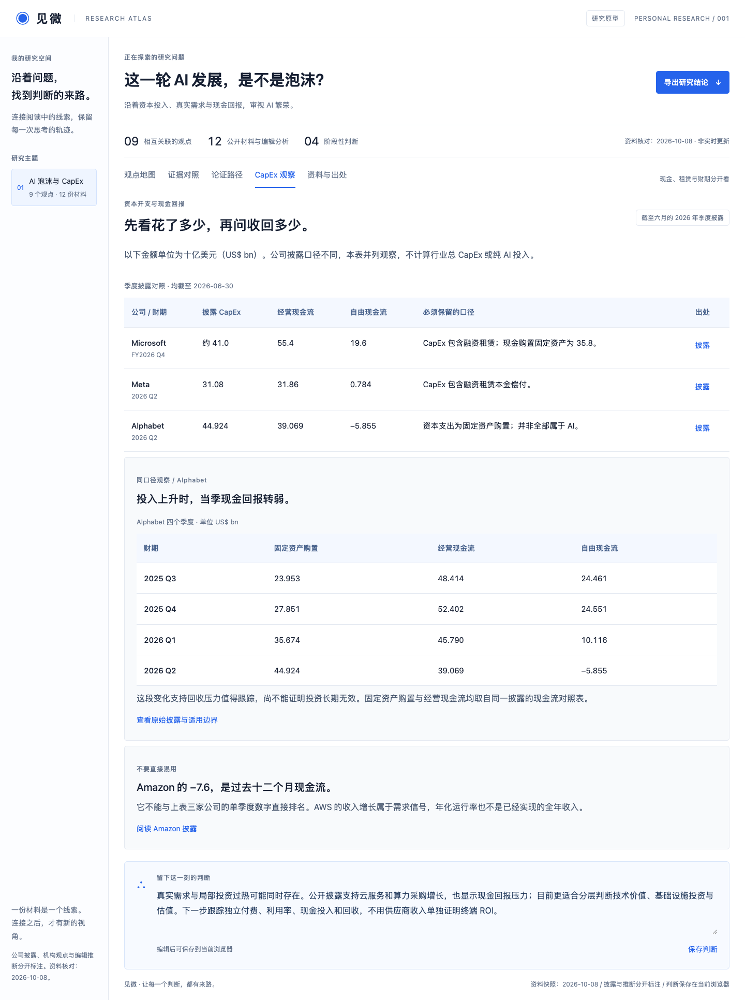
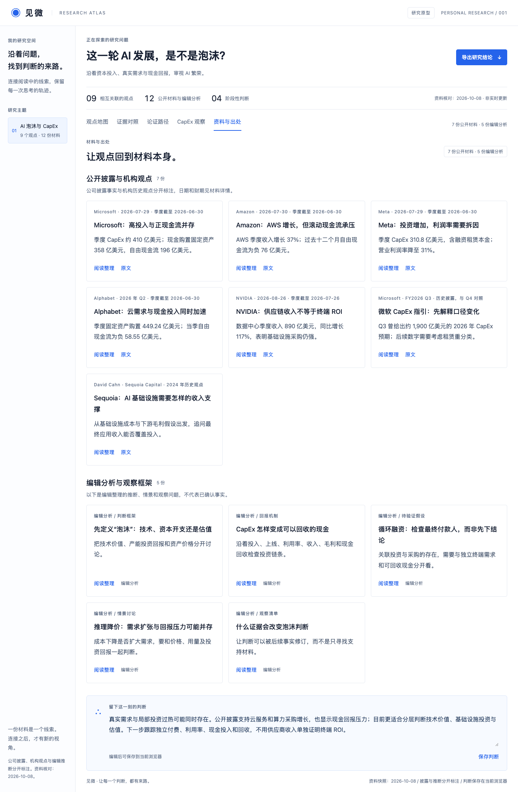

# 见微 · AI 泡沫与 CapEx 观察

**这一轮 AI 发展，是不是泡沫？** 一个由 AI 辅助设计与开发的交互研究项目，从大厂资本开支、算力需求、现金回报与估值出发，把每条判断连接到可核对的材料。

技术有价值，不代表基础设施投资一定有回报；需求真实，也不代表估值一定合理。这个项目把这三个问题分开讨论，并让支持与反对泡沫判断的证据同时可见。

> 资料核对日期：2026-10-08。页面使用经过整理的静态材料，不自动更新，不在运行时调用模型。公司披露、机构观点、编辑分析和待验证假设分别标注。

[在线体验](https://cl4793-del.github.io/jianwei-ai-capex/) · [项目源码](https://github.com/cl4793-del/jianwei-ai-capex)

## 30 秒体验

1. 点击「观点地图」中的节点，查看判断依据与待解问题。
2. 打开「证据对照」，同时阅读支持和挑战泡沫判断的材料。
3. 在「CapEx 观察」比较资本支出与现金回报，留意租赁口径和财期。
4. 在「资料与出处」阅读中文整理，并打开原始披露。
5. 沿「论证路径」查看示例判断如何修订，修改自己的结论并导出带出处的 Markdown。

## 项目预览


<details>
<summary>查看资本开支与现金回报页面</summary>



</details>

<details>
<summary>查看全部研究材料</summary>



</details>

## 讨论框架

| 问题 | 页面如何呈现 |
| --- | --- |
| 花了多少，什么时候收回？ | CapEx、经营现金流与自由现金流并列，并保留定义差异 |
| 需求是不是假的？ | 云业务与供应链的增长证据，同时区分设备采购与终端 ROI |
| 是否存在局部过热？ | 现金压力、利用率和最终付款能力的待验证问题 |
| 指引变小就等于投资降温吗？ | 微软融资租赁与经营租赁重分类的材料对照 |
| 推理更便宜会怎样？ | 需求扩张与价格、毛利压力的两种情景 |
| 技术成功就值得任何价格吗？ | 技术价值、基础设施回报和估值三个层次分别讨论 |

当前包含 **9 个观点、8 条证据线索、4 个示例论证阶段、12 份材料**。其中 7 份为公司披露或机构历史观点，5 份为编辑分析。地图连线表示研究关联，不代表因果；论证路径是编辑构造的示例，不是用户的实际研究记录。

## 资料与出处

| 原始材料 | 作用与范围 |
| --- | --- |
| [Microsoft FY2026 Q4 财报电话会](https://www.microsoft.com/en-us/investor/events/fy-2026/earnings-fy-2026-q4) | 季度资本支出、现金回报与租赁重分类 |
| [Amazon 2026 Q2 财报](https://ir.aboutamazon.com/news-release/news-release-details/2026/Amazon-com-Announces-Second-Quarter-Results/default.aspx) | AWS 增长、过去十二个月现金回报与 AI 运行率 |
| [Meta 2026 Q2 财报](https://investor.atmeta.com/investor-news/press-release-details/2026/Meta-Reports-Second-Quarter-2026-Results/) | CapEx、融资租赁本金、费用与利润率 |
| [Alphabet 2026 Q2 财报 · SEC Exhibit 99.1](https://www.sec.gov/Archives/edgar/data/1652044/000165204426000066/googexhibit991q22026.htm) | 云业务、固定资产购置与四季度现金流序列 |
| [NVIDIA FY2027 Q2 财报](https://nvidianews.nvidia.com/news/nvidia-announces-financial-results-for-second-quarter-fiscal-2027) | 供应链需求；财季截至七月，与六月季度不同 |
| [Microsoft FY2026 Q3 电话会](https://www.microsoft.com/en-us/investor/events/fy-2026/earnings-fy-2026-q3) | 历史 CapEx 指引，用于对照口径变化 |
| [Sequoia · AI’s $600B Question](https://sequoiacap.com/article/ais-600b-question) | 2024 年历史观点，作为收入与成本匹配的提问框架 |

页面不把总 CapEx 全部算作 AI 投入，不把季度与过去十二个月现金流直接排名，不把年化运行率当作已经实现的全年收入，也不把 Sequoia 的历史估算沿用为当前缺口。每份材料都说明证据边界，没有生成泡沫概率或证券估值。

## AI 在项目中做了什么

AI 辅助完成产品构思、页面开发、公开来源检索、中文整理、交互检查和展示文档。项目展示的是 **AI 辅助研究如何保留出处、反向证据与不确定性**。运行中的页面不调用模型，不读取个人笔记，也不自动判断投资回报。

## 本地运行

无需安装依赖，在仓库目录运行：

```bash
python3 -m http.server 8765 --directory dist
```

打开 `http://localhost:8765/`。全部界面文件在 `dist/`，没有构建步骤。

## GitHub Pages

仓库附带静态发布流程。在 **Settings → Pages → Build and deployment** 中选择 **GitHub Actions**，然后在 **Actions** 运行 **Deploy demo to GitHub Pages**。发布成功后，仓库 About 中可以填写在线地址，以便直接分享体验。

发布流程只上传 `dist/`。项目没有 API 密钥、私人研究材料和站点访问凭据。

## 实现与验证

原生 HTML、CSS、JavaScript，白色与蓝色主题。支持键盘切换视图、材料弹窗、可编辑结论、当前浏览器保存与带引用的 Markdown 导出。结论按主题保存在 localStorage，不与其他主题混用，不进行云端同步。

公开数据保存为固定日期快照；资本开支表使用各公司的原始披露，记录公司、财期、单位与口径。浏览器不支持 WebMCP 时正常运行；该能力没有可用的验证环境，未宣称已经验证。

下一阶段可增加财报导入与同口径更新，由 AI 提取引用，并由用户确认事实与推断的对应关系。当前未实现自动抓取、预测或交易功能。

财务口径、数据转换和比较限制见 [数据说明](docs/data-notes.md)。
